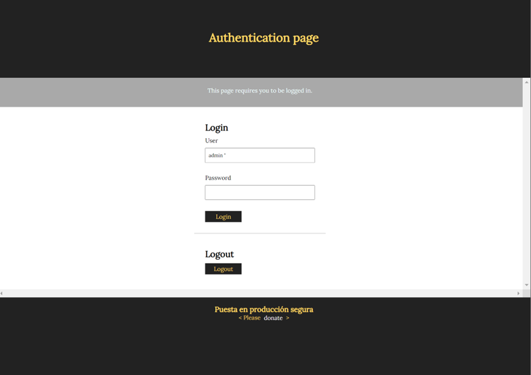
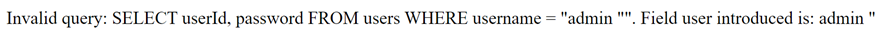
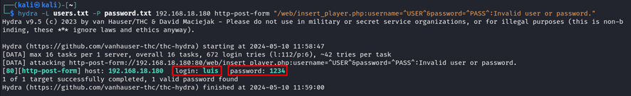
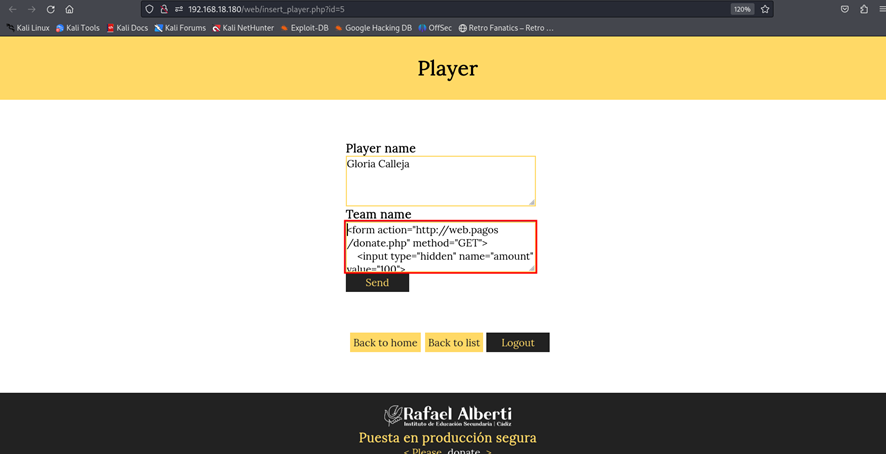
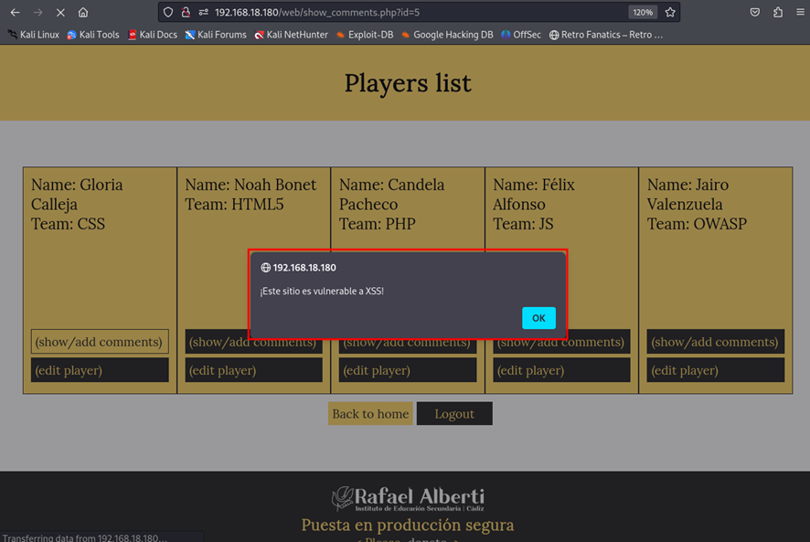
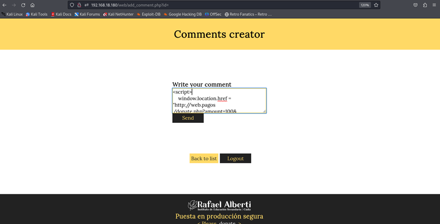
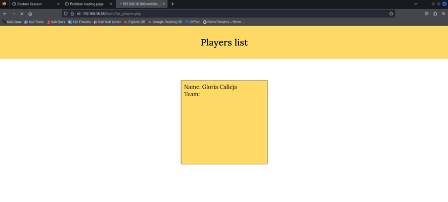

# Informe técnico de la empresa ¿Ciberseguros? G4.

Trabajo realizado por:
- Iván Sales Cisneros

## Índice

1. [Declaración de confidencialidad](#declaración-de-confidencialidad)
2. [Descargo de responsabilidad](#descargo-de-responsabilidad)
3. [Información de contacto](#información-de-contacto)
4. [Resumen ejecutivo](#resumen-ejecutivo)
5. [Calificación de severidad de hallazgos](#calificación-de-severidad-de-hallazgos)
6. [Factores de riesgo](#factores-de-riesgo)
7. [Resumen de vulnerabilidades y Reporte de evaluación](#resumen-de-vulnerabilidades-y-reporte-de-evaluación)

## Declaración de confidencialidad

Este informe y toda la información contenida en él son confidenciales y están destinados únicamente para el uso de la persona o entidad a la que se dirigen. La información, incluidos los datos, resultados, descubrimientos y cualquier otro tipo de información derivada de este informe de pentesting, es propiedad exclusiva de Ivan Sales Cisneros y está protegida por acuerdos de confidencialidad y leyes de propiedad intelectual.
Cualquier revisión, retransmisión, divulgación, copia, distribución o cualquier otro uso de esta información por personas o entidades distintas de los destinatarios está estrictamente prohibido. Si usted no es el destinatario indicado, por favor notifique inmediatamente al remitente y elimine todas las copias de este documento.

## Descargo de responsabilidad

Este informe de pentesting  en el tiempo de la seguridad de los sistemas evaluados. Las vulnerabilidades identificadas se basan en el estado de los sistemas en el momento de las pruebas y pueden no reflejar los riesgos futuros o desconocidos. Se aconseja encarecidamente al destinatario que realice evaluaciones continuas de seguridad y aplique medidas de mitigación adecuadas para abordar los riesgos identificados. El autor de este informe no asume ninguna responsabilidad por cualquier daño o pérdida derivada del uso de la información proporcionada. El destinatario es responsable de la interpretación y aplicación adecuada de los hallazgos contenidos en este informe.

## Información de contacto

- Nombre y apellidos: Iván Sales Cisneros
- Cargo: Pentester 
- Nº Teléfono: +34 625 32 39 03           
- Email: isalcis064@g.educaand.es

## Resumen ejecutivo 

El proyecto Talent ScoutTech tiene como objetivo principal identificar y mitigar las vulnerabilidades existentes en la aplicación de "scouting" tecnológico desarrollada por ACME. Esta aplicación permite a los usuarios añadir jugadores a la base de datos y comentar sobre su idoneidad, pero presenta varias vulnerabilidades que pueden comprometer la seguridad de los datos y la integridad de la plataforma.

Durante la auditoría de la aplicación, se identificaron diversas vulnerabilidades críticas, incluyendo inyecciones SQL, Cross-Site Scripting (XSS), Cross-Site Request Forgery (CSRF) y problemas de gestión de sesiones. Estas vulnerabilidades ponen en riesgo la confidencialidad, integridad y disponibilidad de la aplicación y los datos de los usuarios.

Para abordar estas vulnerabilidades, se han propuesto recomendaciones de mitigación basadas en las mejores prácticas de seguridad y las directrices de OWASP. Estas recomendaciones incluyen la implementación de parches de seguridad, configuraciones adecuadas del servidor y prácticas de codificación seguras.

Es crucial que estas medidas de seguridad se implementen de manera oportuna para proteger la aplicación y garantizar un entorno seguro para los usuarios. Además, se recomienda realizar evaluaciones periódicas de seguridad y proporcionar capacitación al personal para mantener la seguridad de la aplicación a largo plazo.

Este informe servirá como guía para mejorar la seguridad de la aplicación Talent ScoutTech y protegerla contra posibles amenazas y brechas de seguridad. La seguridad de las aplicaciones web es fundamental para garantizar la protección de los datos del usuario y la integridad del sistema.

## Calificación de severidad de hallazgos

| **Severidad** | **Rango de Puntuación CVSS V3** | **Definición**                                               |
| ------------- | :-----------------------------: | :----------------------------------------------------------- |
| Crítico       |            9.0-10.0             | La explotación es sencilla y generalmente resultan en un compromiso a nivel del sistema. Se recomienda elaborar un plan de acción y parchear inmediatamente. |
| Alto          |             7.0-8.9             | La explotación es más difícil, pero podría causar privilegios elevados y potencialmente la pérdida de datos o tiempo de inactividad. Se recomienda formar un plan de acción y parchear tan pronto como sea posible. |
| Moderado      |             4.0-6.9             | Existen vulnerabilidades, pero no son explotables o requieren pasos adicionales como la ingeniería social. Se recomienda formar un plan de acción y parchear después de que se hayan resuelto los problemas de alta prioridad. |
| Bajo          |             0.1-3.9             | Las vulnerabilidades no son explotables pero reducirían la superficie de ataque de una organización. Se recomienda formar un plan de acción y parchear durante la próxima ventana de mantenimiento. |
| Informativo   |               N/A               | No existe vulnerabilidad. Se proporciona información adicional sobre los elementos observados durante la prueba, los controles sólidos y la documentación adicional. |

## Factores de riesgo

El riesgo se mide por dos factores: Probabilidad e Impacto:

### Probabilidad 

La probabilidad mide el potencial de explotación de una vulnerabilidad. Las calificaciones se basan en la dificultad del ataque, las herramientas disponibles, el nivel de habilidad del atacante y el entorno del cliente.

### Impacto 

El impacto mide el efecto potencial de la vulnerabilidad en las operaciones, incluida la confidencialidad, integridad y disponibilidad de los sistemas y/o datos del cliente, el daño reputacional y la pérdida financiera.

## Vulnerabilidades 

Vulnerabilidad 1 - SQL Injection (Fortinet FortiClient EMS)

| Vulnerabilidad 1                           | **Vulnerabilidad de inyección SQL en Fortinet FortiClient EMS que permite a un atacante no autenticado ejecutar comandos SQL arbitrarios, lo que puede llevar a la ejecución de código remoto y acceso no autorizado.** |
|-----------------------------------------------------------|------------------------------------------------------------------------------------------------------------------------------------------------------------------------------------------------------------------------|
| CVE/CWE                                                   | [CVE-2023-48788](https://nvd.nist.gov/vuln/detail/CVE-2023-48788) / CWE-89                                                                                                                                             |
| CVSS v3                                                   | 9.8 (Crítica)                                                                                                                                                                                                         |
| Severidad                                                 | Crítica                                                                                                                                                                                                               |
| Impacto                                                   | Acceso no autorizado, ejecución de código remoto, robo de datos.                                                                                                                                                      |
| Sistemas Afectados                                        | 192.168.18.180                                                                                                                                                                                                        |
| Pruebas de concepto                                       |   específica                                                                                                                                                                                                 |
| Remediación                                               | Aplicar parches de seguridad inmediatamente, mejorar la validación de entradas y sanear los datos ingresados por el usuario.                                                                                           |
| Referencias                                               | [Fortinet Advisory for CVE-2023-48788](https://fortiguard.fortinet.com/advisory/FG-IR-24-007)                                                                                                                          |

Vulnerabilidad 2 - Fuerza Bruta (Hydra Attack)

| Vulnerabilidad 2                            | **Identificación de credenciales válidas mediante ataques de fuerza bruta utilizando la herramienta Hydra sobre interfaces de autenticación inseguras.**                                                               |
|-----------------------------------------------------------|------------------------------------------------------------------------------------------------------------------------------------------------------------------------------------------------------------------------|
| CVE/CWE                                                   | Sin asignación típica                                                                                                                                                                                                  |
| CVSS v3                                                   | Bajo/Medio                                                                                                                                                                                                             |
| Severidad                                                 | Media                                                                                                                                                                                                                  |
| Impacto                                                   | Compromiso de cuentas de usuario por la obtención de credenciales válidas.                                                                                                                                             |
| Sistemas Afectados                                        | 192.168.18.180                                                                                                                                                                                                        |
| Pruebas de concepto                                       |  específica                                                                                                                                                                                                  |
| Remediación                                               | Implementar mecanismos de limitación de tasa, autenticación multifactor y alertas de intentos de acceso sospechosos.                                                                                                    |
| Referencias                                               | [OWASP sobre ataques de Fuerza Bruta](https://owasp.org/www-community/attacks/Brute_force_attack)                                                                                                                      |

Vulnerabilidad 3 - Cross-Site Scripting (XSS)

| Vulnerabilidad 3                            | **Explotación de una vulnerabilidad XSS en un campo de comentarios, permitiendo la ejecución de scripts maliciosos en el navegador de otros usuarios.**                                                                 |
|-----------------------------------------------------------|------------------------------------------------------------------------------------------------------------------------------------------------------------------------------------------------------------------------|
| CVE/CWE                                                   | [CWE-79](https://cwe.mitre.org/data/definitions/79.html)                                                                                                                                                               |
| CVSS v3                                                   | 6.1 (Moderada)                                                                                                                                                                                                         |
| Severidad                                                 | Media/Alta                                                                                                                                                                                                             |
| Impacto                                                   | Ejecución de scripts malintencionados, robo de cookies o tokens de sesión.                                                                                                                                             |
| Sistemas Afectados                                        | 192.168.18.180                                                                                                                                                                                                        |
| Pruebas de concepto                                       |  específica                                                                                                                                                                                                  |
| Remediación                                               | Implementar codificación adecuada de todas las entradas del usuario y validar la salida en el lado del servidor para prevenir la ejecución de HTML/JavaScript inyectado.                                               |
| Referencias                                               | [Guía de OWASP para prevenir XSS](https://cheatsheetseries.owasp.org/cheatsheets/Cross_Site_Scripting_Prevention_Cheat_Sheet.html)                                                                                    |

Vulnerabilidad 4 - Cross-Site Request Forgery (CSRF)

| Vulnerabilidad 4                           | **Explotación de una vulnerabilidad CSRF permitiendo a los atacantes manipular a los usuarios para que realicen acciones no intencionadas como transacciones financieras.**                                              |
|-----------------------------------------------------------|------------------------------------------------------------------------------------------------------------------------------------------------------------------------------------------------------------------------|
| CVE/CWE                                                   | [CWE-352](https://cwe.mitre.org/data/definitions/352.html)                                                                                                                                                             |
| CVSS v3                                                   | 6.3 (Media)                                                                                                                                                                                                            |
| Severidad                                                 | Media                                                                                                                                                                                                                  |
| Impacto                                                   | Realización de acciones no autorizadas en nombre de usuarios autenticados inadvertidamente.                                                                                                                            |
| Sistemas Afectados                                        | 192.168.18.180                                                                                                                                                                                                        |
| Pruebas de concepto                                       |   específica                                                                                                                                                                                                  |
| Remediación                                               | Implementar tokens anti-CSRF en todos los formularios y validar estos tokens en el servidor para cada solicitud POST.                                                                                                   |
| Referencias                                               | [OWASP sobre prevención de CSRF](https://cheatsheetseries.owasp.org/cheatsheets/Cross-Site_Request_Forgery_Prevention_Cheat_Sheet.html)                                                                                |

