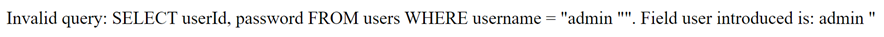
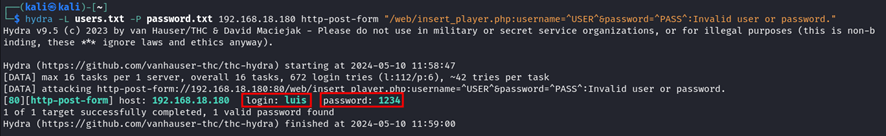
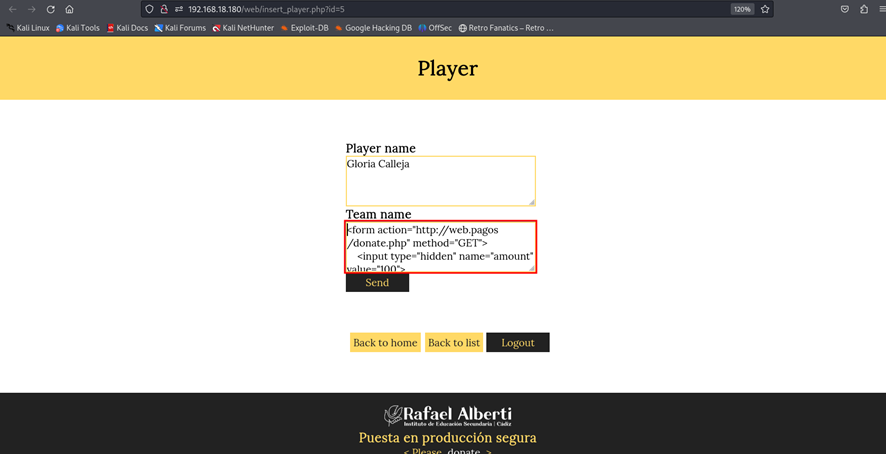
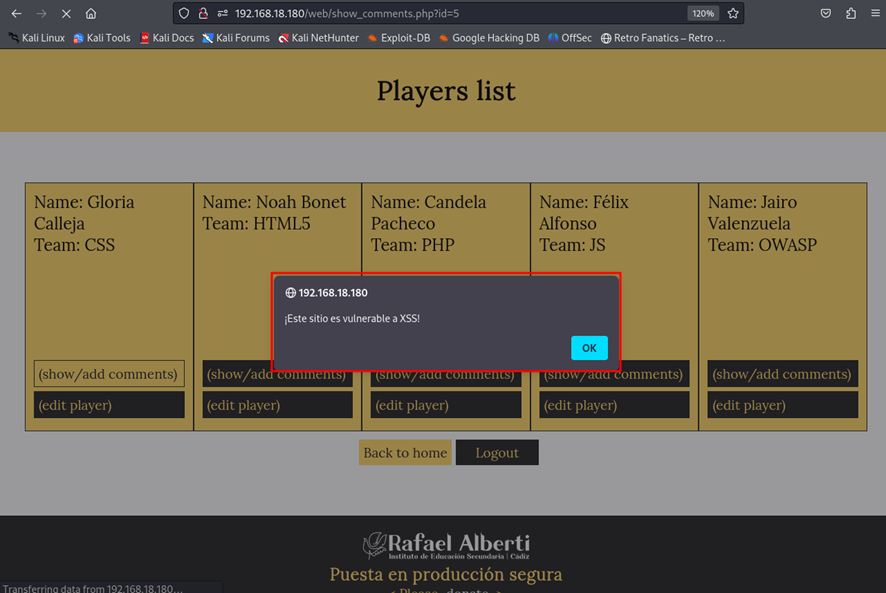
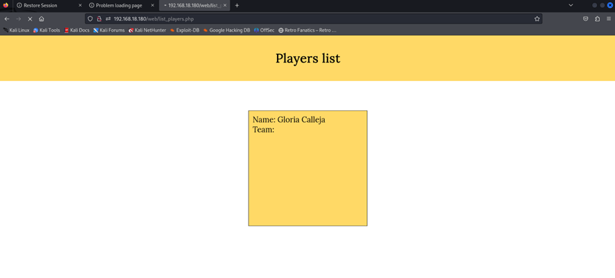

# Informe técnico

## Introducción

Este informe técnico presenta un análisis exhaustivo de seguridad de la aplicación web "Developer Awards". El objetivo principal de este análisis es identificar y evaluar las posibles vulnerabilidades de seguridad presentes en la aplicación, así como proponer medidas correctivas para mitigar los riesgos asociados. La seguridad de las aplicaciones web es un aspecto crucial en la protección de los datos sensibles y la garantía de la privacidad de los usuarios. Por lo tanto, es fundamental realizar evaluaciones periódicas de seguridad y tomar medidas proactivas para abordar cualquier vulnerabilidad identificada.

En este informe, se examinarán diferentes tipos de vulnerabilidades de seguridad, incluidas las inyecciones SQL, las vulnerabilidades de Cross-Site Scripting (XSS), Cross-Site Request Forgery (CSRF), el control de acceso y la gestión de sesiones de usuario. Para cada tipo de vulnerabilidad identificada, se proporcionarán detalles sobre cómo se explotan, el impacto potencial en la seguridad de la aplicación y las medidas correctivas recomendadas para mitigar el riesgo. Este informe servirá como guía para mejorar la seguridad de la aplicación web "Developer Awards" y protegerla contra posibles ataques y brechas de seguridad.

## Parte 1 - SQLi

#### 1.a)

a) Dad un ejemplo de combinación de usuario y contraseña que provoque un error en la consulta SQL generada por este formulario. Apartir del mensaje de error obtenido, decid cuál es la consulta SQL que se ejecuta, cuál de los campos introducidos al formulario utiliza y cuál no.

| Campos                                                   | Detalles                                                      |
|----------------------------------------------------------|---------------------------------------------------------------|
| Escribo los valores...                                   | Usuario: admin "  Contraseña: (cualquier valor o dejado en blanco) |
| Del formulario de la página                              | Página de autenticación                                       |
| La consulta SQL que se ejecuta es...                     | SELECT userId, password FROM users WHERE username = "admin "" |
| Campos del formulario web utilizados en la consulta SQL  | Campo de usuario (username)                                   |
| Campos del formulario web no utilizados en la consulta SQL | Campo de contraseña (password)                               |

#### 1.b) 

Gracias a la SQL Injection del apartado anterior, sabemos que este formulario es vulnerable y conocemos el nombre de los campos de la tabla “users”. Para tratar de impersonar a un usuario, nos hemos descargado un diccionario que contiene algunas de las contraseñas más utilizadas (se listan a continuación):

password
123456
12345678
1234
qwerty
12345678
dragon

Dad un ataque que, utilizando este diccionario, nos permita impersonar un usuario de esta aplicación y acceder en nombre suyo. Tened en cuenta que no sabéis ni cuántos usuarios hay registrados en la aplicación, ni los nombres de estos.

| Campos                                                   | Detalles                                                      |
|----------------------------------------------------------|---------------------------------------------------------------|
| Explicación del ataque                                   | El ataque realizado fue un ataque de fuerza bruta utilizando Hydra. Hydra es una herramienta de prueba de penetración que puede realizar ataques de fuerza bruta para encontrar nombres de usuario y contraseñas válidos. En este caso, se utilizó una lista de nombres de usuario proporcionada en el archivo `/usr/share/wordlists/seclists/Usernames/Names/names.txt` y una lista de contraseñas proporcionada en el archivo `password.txt` para intentar iniciar sesión en una página web a través de un formulario. La herramienta intentó iniciar sesión con cada combinación de nombre de usuario y contraseña hasta encontrar una combinación válida. |
| Campo de usuario con que el ataque ha tenido éxito        | luis                                                          |
| Campo de contraseña con que el ataque ha tenido éxito    | 1234                                                          |

#### 1.c) 
si vais a private/auth.php, veréis que en la función areUserAndPasswordValid”, se utiliza “SQLite3::escapeString()”, pero, aun así, el formulario es vulnerable a SQL Injections, explicad cuál es el error de programación de esta función y como lo podéis corregir.

El error en el código que permite la inyección SQL es en usar solo SQLite3::escapeString() para proteger contra ataques. Esta función no permite una protección completa contra todas las formas de inyección SQL. Para corregir esto, es crucial reemplazar escapeString() con consultas preparadas y parámetros vinculados. Este enfoque separa los datos del formulario de la consulta SQL, evitando que los atacantes manipulen la estructura de la consulta y asegurando protección contra las inyecciones SQL.

#### 1.d)
 Si habéis tenido éxito con el apartado b), os habéis autenticado utilizando elusuario “luis” (si no habéis tenido éxito, podéis utilizar la contraseña “1234” para realizar este apartado). Con el objetivo de mejorar la imagen de la jugadora “Candela Pacheco”, le queremos escribir un buen puñado de comentarios positivos, pero no los queremos hacer todos con la misma cuenta de usuario.

Para hacer esto, en primer lugar habéis hecho un ataque de fuerza bruta sobre eldirectorio del servidor web (por ejemplo, probando nombres de archivo) y habéis encontrado el archivo “add_comment.php~”. Estos archivos seguramente se han creado como copia de seguridad al modificar el archivo “.php” original directamente al servidor. En general, los servidores web no interpretan (ejecuten) los archivos “.php~” sino que los muestran como archivos de texto sin interpretar.

Esto os permite estudiar el código fuente de “add_comment.php” y encontrar una vulnerabilidad para publicar mensajes en nombre de otros usuarios. ¿Cuál es esta vulnerabilidad, y cómo es el ataque que utilizáis para explotarla?

La vulnerabilidad en el archivo "add_comment.php" que permite publicar mensajes en nombre de otros usuarios es probablemente la falta de autenticación adecuada o la validación insuficiente de la identidad del usuario que envía el comentario. Esto significa que el formulario de comentarios no verifica si el usuario que envía el formulario está realmente autenticado como el usuario que dice ser. Como resultado, un atacante puede manipular manualmente el formulario para enviar comentarios en nombre de cualquier usuario, incluidos aquellos que no están autenticados.

Para explotar esta vulnerabilidad, un atacante puede utilizar el formulario de comentarios proporcionado en la página "add_comment.php" y enviar un comentario utilizando el nombre de usuario deseado, como "luis" en este caso. El atacante puede manipular manualmente el formulario HTML para cambiar el valor del campo "username" a "luis" y enviar el comentario utilizando este nombre de usuario. Como no hay una verificación adecuada de la identidad del usuario que envía el formulario, el comentario se publicará en nombre de "luis" sin necesidad de autenticación real como ese usuario. Esto permite al atacante publicar mensajes en nombre de otros usuarios de manera no autorizada.

## Parte 2 - XSS

En vistas de los problemas de seguridad que habéis encontrado, empezáis a sospechar que esta aplicación quizás es vulnerable a XSS (Cross Site Scripting).

#### 2.a) 
Para ver si hay un problema de XSS, crearemos un comentario que muestre un alert de Javascript siempre que alguien consulte el/los comentarios de aquel jugador (show_comments.php). Dad un mensaje que genere un «alert»de Javascript al consultar el listado de mensajes.

Ingresamos en el apartado show_comments.php de algun usuario el siguiente texto ""
Este comentario permitá que salte una alerta la proxima vez que se entre a ver los comentarios

#### 2.b) 
Por qué dice "&" cuando miráis un link(como elque aparece a la portada de esta aplicación pidiendo que realices un donativo) con parámetros GETdentro de código html si en realidad el link es sólo con "&" ?

La diferencia entre las dos URLs radica en cómo se codifican los caracteres especiales, como el "&", en HTML. En la primera URL, "http://www.donate.co/?amount=100&destination=ACMEScouting/", el "&" se utiliza directamente como un carácter en la URL. Sin embargo, en HTML, el "&" se interpreta como un carácter especial que marca el inicio de una entidad HTML, lo que puede causar problemas de interpretación si se usa directamente en un enlace HTML. Por otro lado, en la segunda URL, "https://www.donate.com/?amount=100&amp;destination=ACMEScouting/", se utiliza la entidad HTML "&" en lugar del "&".

#### 2.c) 
Explicad cuál es el problema de show_comments.php, y cómo lo arreglaríais. Para resolver este apartado, podéis mirar el código fuente de esta página.

El problema en show_comments.php es la falta de validación y escape de datos de los comentarios antes de mostrarlos en la página. Esto deja la aplicación vulnerable a ataques de Cross-Site Scripting (XSS), donde un atacante puede insertar código malicioso en los comentarios para que se ejecute en el navegador de otros usuarios.

Para solucionarlo, se debe implementar una validación y escape adecuados de los datos de los comentarios antes de mostrarlos en la página. Para ello, en PHP se puede utilizar la función htmlspecialchars(). Esto garantiza que cualquier código HTML o JavaScript malicioso en los comentarios sea interpretado como texto plano y no como código ejecutable.

#### 2.d) 
Descubrid si hay alguna otra página que esté afectada por esta misma vulnerabilidad. En caso positivo, explicad cómo lo habéis descubierto.

Todas las paginas estas afectadas por la misma vulnerabilidad, ya que todas las páginas tienen el mismo enlace a donate.

## Parte 3 Control de acceso, autenticación y sesiones de usuarios

#### 3.a)
En el ejercicio 1, hemos visto cómo era inseguro el acceso de los usuarios a la aplicación. En la página de register.php tenemos el registro de usuario. ¿Qué medidas debemos implementar para evitar que el registro sea inseguro? Justifica esas medidas e implementa las medidas que sean factibles en este proyecto.

- Validación de entrada: Verificar que los datos ingresados por el usuario cumplan con los requisitos establecidos, como longitud mínima y ausencia de caracteres especiales.

- Escape de datos: Utilizar funciones de escape adecuadas, como mysqli_real_escape_string() en PHP, para evitar la inyección de SQL al almacenar los datos en la base de datos.

- Verificación de duplicados: Antes de registrar un nuevo usuario, comprobar si el nombre de usuario ya existe en la base de datos para evitar registros duplicados.

- Uso de contraseñas seguras: Establecer requisitos mínimos para las contraseñas, como longitud mínima y combinación de caracteres alfanuméricos y especiales.

- Almacenamiento seguro de contraseñas: Utilizar técnicas de hash y salting, como bcrypt o Argon2, para almacenar las contraseñas de forma segura en la base de datos.

#### 3.b) 
En el apartado de login de la aplicación, también deberíamos implantar una serie de medidas para que sea seguro el acceso, (sin contar la del ejercicio 1.c). Como en el ejercicio anterior, justifica esas medidas e implementa las que sean factibles y necesarias (ten en cuenta las acciones realizadas en el register). Puedes mirar en la carpeta private

- Autenticación de dos factores (2FA): Solicitar al usuario que ingrese un código enviado a su dispositivo móvil después de ingresar sus credenciales de inicio de sesión.

- Bloqueo de cuentas después de múltiples intentos fallidos: Después de tres intentos fallidos de inicio de sesión, bloquear la cuenta temporalmente durante 15 minutos.

- Control de sesiones seguras: Generar tokens de sesión aleatorios y seguros para cada inicio de sesión y configurar tiempos de expiración cortos para estos tokens.

- Registro de actividad de inicio de sesión: Registrar la dirección IP del usuario, la hora y la fecha de cada inicio de sesión en un registro de auditoría seguro.

- Actualización periódica de contraseñas: Requerir que los usuarios cambien sus contraseñas cada 90 días y que las nuevas contraseñas cumplan con requisitos de complejidad, como longitud mínima y uso de caracteres especiales.

- Validación estricta de formularios en el lado del servidor: Validar todos los datos de entrada del usuario en el lado del servidor para evitar inyecciones SQL y otros ataques, como la validación de longitud y tipo de datos.

#### 3.c) 
Volvemos a la página de register.php, vemos que está accesible para cualquier usuario, registrado o sin registrar. Al ser una aplicación en la cual no debería dejar a los usuarios registrarse, qué medidas podríamos tomar para poder gestionarlo e implementa las medidas que sean factibles en este proyecto.

- Autenticación de usuario administrador: Crear un usuario administrador con privilegios especiales. Solo este usuario tendrá acceso a la página de registro.

- Control de acceso basado en roles (RBAC): Implementar un sistema que permita definir roles de usuario y asignar permisos. Solo los usuarios con el rol de administrador podrán acceder a la página de registro.

- Protección mediante middleware: Utilizar middleware en el servidor para verificar el rol del usuario antes de permitir el acceso a register.php. Por ejemplo, verificar si el usuario tiene el rol de administrador antes de mostrar la página de registro.

- Ocultar enlaces de registro: Deshabilitar o eliminar los enlaces a la página register.php para los usuarios que no sean administradores. Esto evitará que accedan directamente a la página de registro.

- Registro de auditoría: Registrar cualquier intento de acceso no autorizado a register.php en un registro de auditoría. Esto permitirá detectar y responder rápidamente a posibles intentos de acceso no autorizados.

#### 3.d) 
Al comienzo de la práctica hemos supuesto que la carpeta private no tenemos acceso, pero realmente al configurar el sistema en nuestro equipo de forma local. ¿Se cumple esta condición? ¿Qué medidas podemos tomar para que esto no suceda?

- Autenticación y autorización basadas en roles: Implementar un sistema de autenticación que requiera que los usuarios inicien sesión con credenciales válidas antes de acceder a la carpeta "private". Además, establecer roles de usuario y otorgar permisos específicos según el rol. Por ejemplo, solo los administradores tendrán acceso a la carpeta "private"

- Protección con contraseñas seguras: Asegurarse de que cualquier recurso protegido, como la carpeta "private", esté protegido con contraseñas seguras. Esto implica utilizar contraseñas robustas que incluyan una combinación de letras, números y caracteres especiales, y actualizarlas regularmente.

- Validación de entrada: Implementar una validación estricta de entrada para evitar ataques de inyección SQL u otros ataques de manipulación de datos. Por ejemplo, validar todos los parámetros de entrada antes de procesarlos para asegurarse de que no contengan caracteres maliciosos.

- Control de acceso a nivel de servidor: Configurar el servidor web para que restrinja el acceso a la carpeta "private" solo a ciertas direcciones IP o rangos de direcciones IP autorizados. Esto ayudará a prevenir el acceso no autorizado desde fuera de la red local.

- Registro de auditoría: Implementar un registro de auditoría que registre todos los intentos de acceso a la carpeta "private", incluidos los intentos fallidos. Esto permitirá realizar un seguimiento de cualquier actividad sospechosa y tomar medidas correctivas de inmediato.

#### 3.e) 
Por último, comprobando el flujo de la sesión del usuario. Analiza si está bien asegurada la sesión del usuario y que no podemos suplantar a ningún usuario. Si no está bien asegurada, qué acciones podríamos realizar e implementarlas.

- Uso de cookies seguras: Configurar las cookies de sesión para que solo se envíen a través de conexiones HTTPS seguras, evitando así que sean interceptadas por terceros. Por ejemplo, establecer la bandera "secure" en verdadero en la configuración de las cookies.

- Token de sesión único y aleatorio: Generar un token de sesión único y aleatorio para cada usuario después de iniciar sesión. Este token debe ser difícil de predecir y asociado con la sesión del usuario. Por ejemplo, generar un token utilizando un algoritmo de generación de números aleatorios criptográficamente seguro.

- Firmado y cifrado de cookies: Firmar y cifrar las cookies de sesión para proteger su integridad y confidencialidad. Por ejemplo, utilizar técnicas de cifrado como AES para cifrar los datos de la cookie y HMAC para firmar los datos y evitar la manipulación.

- Control de tiempo de sesión: Establecer un tiempo de expiración para las sesiones de usuario y cerrar automáticamente la sesión después de un período de inactividad. Por ejemplo, configurar un tiempo de expiración de sesión de 30 minutos y volver a autenticar al usuario si la sesión expira.

- Verificación de identidad en cada solicitud: Verificar la identidad del usuario en cada solicitud mediante la validación del token de sesión. Por ejemplo, verificar la firma y el tiempo de expiración del token antes de permitir el acceso a recursos protegidos.

## Parte 4 - Servidores web
¿Qué medidas de seguridad se implementariaís en el servidor web para reducir el riesgo a ataques?

- Validación de entrada de usuario: Implementar una estricta validación de todos los datos ingresados por los usuarios antes de procesarlos en el servidor. Por ejemplo, validar campos como nombre de usuario y contraseña para asegurarse de que solo contienen caracteres permitidos y longitud adecuada.

- Uso de consultas parametrizadas: Utilizar consultas parametrizadas en lugar de concatenación de cadenas para construir consultas SQL dinámicamente. Esto ayuda a prevenir las inyecciones SQL al separar los datos de los comandos SQL y evitar la interpretación no deseada de datos de usuario como parte de la consulta.

- Escape de caracteres especiales: Almacenar datos de usuario en la base de datos utilizando funciones de escape apropiadas para evitar la interpretación incorrecta de caracteres especiales como comillas simples o dobles. Por ejemplo, utilizar funciones como mysqli_real_escape_string() o prepared statements para escapar datos antes de insertarlos en consultas SQL.

- Restricción de privilegios de base de datos: Limitar los privilegios de la cuenta de base de datos utilizada por la aplicación web para acceder a la base de datos. Esto minimiza el impacto de cualquier inyección SQL exitosa al restringir las operaciones que la cuenta puede realizar en la base de datos.

- Auditorías de código: Realizar auditorías de código periódicas para identificar posibles vulnerabilidades de seguridad, incluyendo inyecciones SQL. Revisar regularmente el código de la aplicación en busca de prácticas inseguras de manejo de datos y corregirlas de manera proactiva.

- Implementación de firewalls de aplicaciones web (WAF): Configurar un WAF para filtrar y monitorear el tráfico HTTP/HTTPS entrante y saliente. Un WAF puede detectar y bloquear ataques de inyección SQL antes de que lleguen al servidor web, proporcionando una capa adicional de protección.

## Parte 5 - CSRF
Ahora ya sabemos que podemos realizar un ataque XSS. Hemos preparado el siguiente enlace: http://web.pagos/donate.php?amount=100&receiver=attacker, mediante el cual, cualquiera que haga click hará una donación de 100€ al nuestro usuario (con nombre 'attacker') de la famosa plataforma de pagos online 'web.pagos' (Nota: como en realidad esta es una dirección inventada, vuestro navegador os devolverá un error 404).

#### 5.a) 
Editad un jugador para conseguir que, en el listado de jugadores (list_players.php) aparezca, debajo del nombre de su equipo y antes de “(show/add comments)” un botón llamado “Profile” que corresponda a un formulario que envíe a cualquiera que haga clic sobre este botón a esta dirección que hemos preparado.

Primero, en uno de los usuarios, en el campo "team name" añadimos el siguiente código HTML: 

`form action="http://web.pagos/donate.php" method="GET">
    <input type="hidden" name="amount" value="100">
    <input type="hidden" name="receiver" value="attacker">
    <button type="submit">Profile</button>
</form>`

Posteriormente, tras darle al botón de “Send” para enviar el código php, vamos a la lista de jugadores (list_players.php) y nos aparece el botón "Profile" debajo del nombre de su equipo, antes de "(show/add comments)", que nos redirige a la página indicada al hacer clic.

### 5.b)
Una vez lo tenéis terminado, pensáis que la eficacia de este ataque aumentaría si no necesitara que elusuario pulse un botón.Con este objetivo, cread un comentario que sirva vuestros propósitos sin levantar ninguna sospecha entre los usuarios que consulten los comentarios sobre un jugador (show_comments.php).

Primero, añadimos un comentario malicioso en el formulario de comentarios de un jugador en la página show_comments.php. Este comentario contiene un script HTML que se ejecutará automáticamente al cargar la página. El script que añadimos es: 

Luego, cuando accedemos a la lista de jugadores en list_players.php y visualizamos los comentarios sobre un jugador en show_comments.php, el script malicioso se ejecutará automáticamente sin que el usuario necesite hacer clic en ningún botón. Esto aumenta la eficacia del ataque al no levantar sospechas entre los usuarios y realizar la acción deseada de forma automática.

c) Pero 'web.pagos' sólo gestiona pagos y donaciones entre usuarios registrados, puesto que, evidentemente, le tiene que restar los 100€ a la cuenta de algún usuario para poder añadirlos a nuestra cuenta.

Explicad qué condición se tendrá que cumplir por que se efectúen las donaciones de los usuarios que visualicen el mensaje del apartado anterior o hagan click en el botón del apartado a).

Para que se efectúen las donaciones de los usuarios que visualicen el mensaje malicioso o hagan clic en el botón, se tendría que cumplir la condición de que estén autenticados en la plataforma 'web.pagos'. Dado que 'web.pagos' solo gestiona pagos y donaciones entre usuarios registrados, cualquier acción que involucre transferencia de fondos requeriría que el usuario esté autenticado en el sistema.

Por lo tanto, para que las donaciones se realicen con éxito, los usuarios que visualicen el mensaje malicioso o hagan clic en el botón tendrían que estar registrados y haber iniciado sesión en 'web.pagos'. De lo contrario, la plataforma requerirá que se autentiquen antes de procesar la donación.

d) Si 'web.pagos' modifica la página 'donate.php' para que reciba los parámetros a través de POST, quedaría blindada contra este tipo de ataques? En caso negativo, preparad un mensaje que realice un ataque equivalente al de la apartado b) enviando los parámetros “amount” i “receiver” por POST.

En este HTML, se ha incluido un formulario que envía automáticamente una solicitud GET a 'donate.php' de 'web.pagos', con los parámetros "amount=100" y "receiver=attacker".

Posteriormente accedemos a la web desde el navegador y automaticamente, al cargar esta página, el navegador ejecuta el código HTML que contiene el formulario de ataque CSRF.

Redirección a la página de donación: Después de cargar el HTML en el navegador, este automáticamente realiza la solicitud GET al 'donate.php' de 'web.pagos', lo que provoca que se realice la donación de 100€ al usuario 'attacker'. La página web se redirige automáticamente a la página que procesa la donación, confirmando que el ataque CSRF ha sido exitoso.

