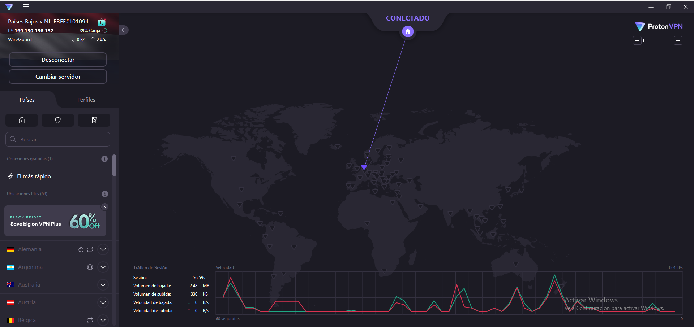
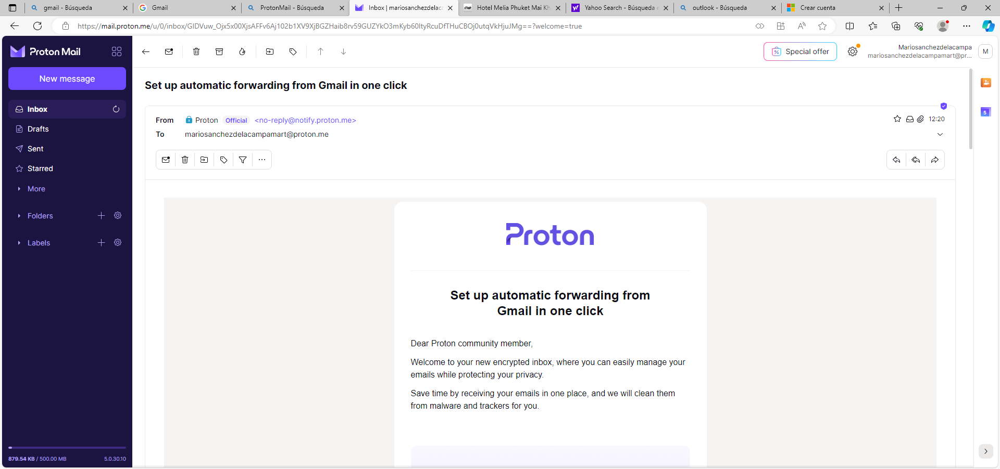
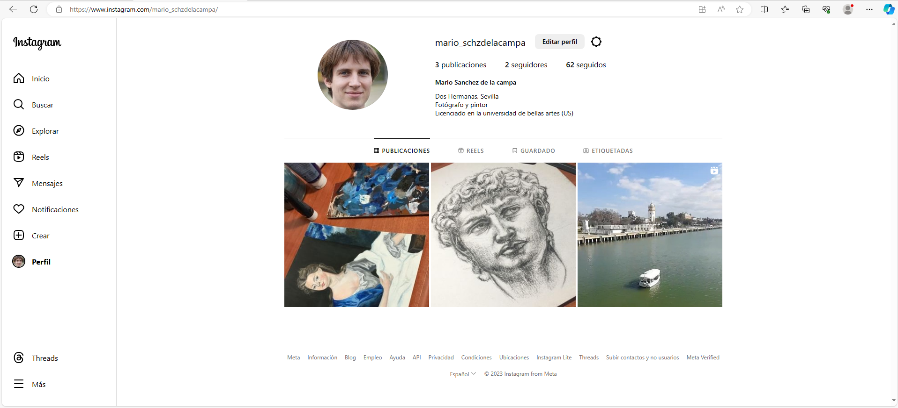
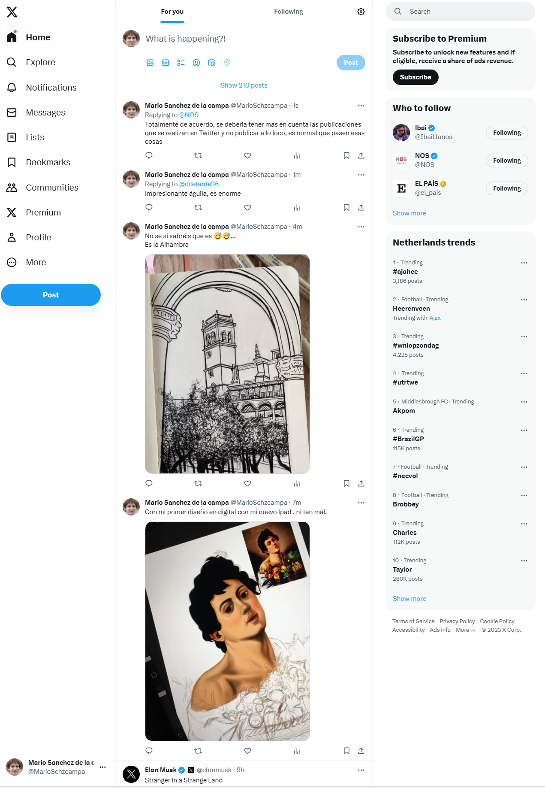
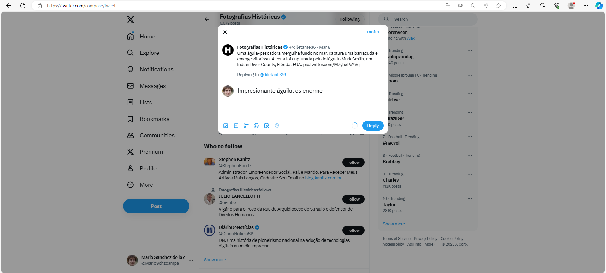
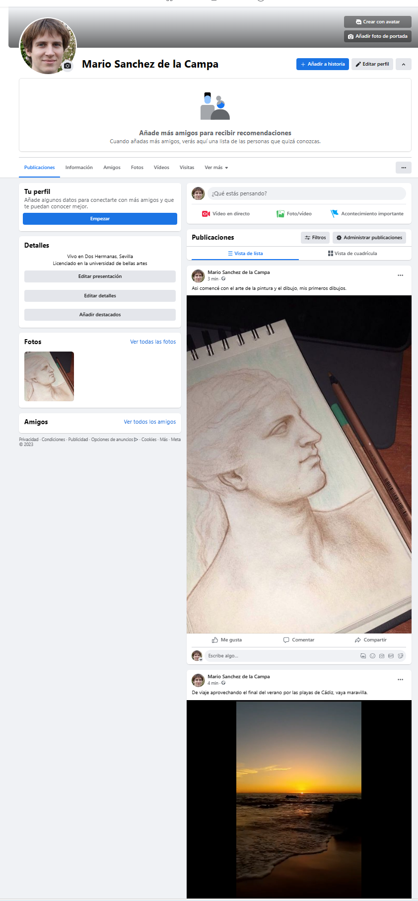

# **Sock Puppets** 

### **Identidad de mi sock puppets** 

**Nombre:** Mario Sánchez de la campa Martinez 

**Edad:** 23 años 

**Profesión:** Fotógrafo y pintor 

**Lugar de nacimiento:** Dos Hermanas, Sevilla, España **Lugar de trabajo:** Sevilla 

**Hobbie:** En su tiempo libre le gusta escuchar música, dibujar, hacer cuadros y salir por la naturaleza en busca de países bonitos para realizar fotografías. 

**Habilidades:** Algo en lo que destaca es en la parte artísticas y en la fotografía. 

**Educación:** Estudió en el IES San Isidoro la ESO, hizo también bachillerato allí y a continuación la carrera de bellas artes.  

**Trayectoria profesional:** El año pasado terminó la carrera de bellas artes y ahora está trabajando de diseñador gráfico y de comunicación visual. 

**Descripción física:** Mario es un hombre de estatura media, mide 1.70 metros de altura, con el pelo liso y castaño y ojos cafés. Tiene una complexión delgada. 

**Intereses y pasatiempos:** Mario es un apasionado de la pintura y la fotografía y pasa mucho tiempo diseñando y dibujando paisajes bonitos. Le gusta viajar para explorar nuevas ciudades y capturar la esencia de la arquitectura local. Además, es un aficionado a la cocina y disfruta de experimentar con recetas de diferentes culturas. 

**Personalidad**: Es una persona tranquila y reflexiva, pero también tiene un lado creativo y apasionado cuando se trata de su trabajo. Es amable y tiene una actitud positiva hacia la vida. Tiende a ser muy organizado y detallista en su trabajo, lo que le ha llevado a tener éxito en su carrera. 

**Historia de vida:** Alejandro creció en una familia donde se fomentaba la creatividad y el arte. Desde joven, mostró un interés particular por la fotografía, siempre tenía que llevar una cámara en su mano y un cuaderno y un lápiz para dibujar, lo que lo llevó a elegir la dicha carrera.  

Primero  configuraremos  la  VPN  antes  de  realizar  cualquier  consulta  o  busqeudad  en interenet referente a la creación del sock puppet, para protegernos de que cualquiera nos descubra la identidad real del sock puppet. Para ellos instalaremos en la máquina virtual de Windows 10 asignada para el sock puppet, Proton VPN. 

Uno de los primeros pasos para crear mi sock puppets es configurar la cuenta de correo electrónico, para posteriormente crear diferentes redes sociales, todos estos pasos serán realizados siempre en el entorno virtual y nunca realizaremos ninguna búsqueda mediante otro dispositivo.  

Creamos una cuenta de ProtonMail ya que, las plataformas de correo electrónico habituales piden verificación de correo electrónico. 

A continuación, vamos a crear varias redes sociales donde mostraremos nuestro perfil en diversas redes sociales, en estas expondremos que el perfil creado es fotógrafo y pintor y tiene una gran pasión por la fotografía. 

Hemos empezado a seguir a diversas personas para crear mayor credibilidad en todas las redes sociales, generalmente hemos seguido a cuentas de fotografías, famosos, etc. 

Las tres redes sociales que vamos a cerrar serán Fecebook, Instagram y Twitter, es todas ellas, utilizaremos como método de verificación la cuenta de Proton creada con la VPN activada, lo cual garantiza que seamos inidentificables en todo momento. 

Se han publicado fotos y videos de algunas pinturas y paisajes, todas esas fotografías han sido realizadas por mí por tanto no habrá forma de descubrir que esas fotos son ficticias. La foto de perfil ha sido cogida de la página [“https://www.thispersondoesnotexist.com/”](https://www.thispersondoesnotexist.com/). 

Empezamos con Instagram: 

A continuación, en Twitter también se ha publicado algún tweet en mi portal y también publicando algún tweet en alguna cuenta y hemos seguido varias cuentas para ver que tenemos interacción en dicha plataforma, hemos seguido todo tipo de cuentas, desde periódicos, hasta famosos y cuentas de diseño, fotografía y dibujo, entre otras. 

Al igual que en Instagram, nos registraremos con el correo de Proton. 

Haremos  lo  mismo  en  Facebook,  seguiremos  a  varias  cuentas  para  generar  mayor credibilidad y publicaremos algunas fotos y vídeos relacionadas con su la pintura y el dibujo. 

Al igual que en el resto de plataformas, nos registraremos con el correo de Proton. 

1. **¿Cuál es la definición de un Sock Puppet?** 

Un Sock Puppet es una identidad ficticia virtual generado por un individuo o grupo con el fin de engañar o manipular a otros. El término se creó en la escena de los debates en internet, donde los usuarios de vez en cuando contaban con cuentas falsas con el fin de aparentar que eran otros usuarios o que compartían sus propios puntos de vista. 

2. **Usos frecuentes de los Sock Puppets:** 
- Manipulación de opinión: Se utilizan para realizar discusiones o debates en internet al exhibir diversas visiones a través de diferentes cuentas que en realidad están bajo el control de solo una persona. 
- Incrementar la popularidad o visibilidad: Es posible utilizarlos para parecer un gran número de seguidores o interacciones en una cuenta o publicación. 
- Engañar  o  acosar: Al  engañar  de  su  verdadera  identidad,  los  individuos  tienen  la posibilidad de sentir más libertad para engañar o molestar a distintos usuarios de internet. 
- Evadir limitaciones o prohibiciones: Si una cuenta es penalizada o no permite interactuar, una  persona  puede  utilizar  un  Sock  Puppet  para  continuar  en  la  interacción  sin  ser reconocido. 
3. **Proceso de creación de mi Sock Puppet** 
- Elegí un nombre de usuario y una contraseña que no fueran fácilmente identificables. 
- Creé una cuenta con un correo electrónico de alias. 
- Subí una foto de perfil que no fuera mía. 
- Personalicé mi perfil para que pareciera que pertenecía a una persona real. 
4. **Reflexiones sobre los desafíos encontrados y cómo los resolviste.** 

Uno de los problemas más grandes a la hora de crear un Sock Puppet es el de evitar que el  descubrimiento.  Para  lograr  esto,  hay  que  ser  precavido  con  la  información  que comunicamos y además con la forma en que interaccionas con los otros usuarios. 

Otro problema que me ha generado durante mi creación del sock puppet fue la verificación de número de teléfono requerida por algunas plataformas. Las páginas de números de teléfono virtuales no son fiables, la mayoría no funcionan, lo que limitó mi capacidad para registrarme en ciertas aplicaciones o servicios. Antes de rendirme opté por crear un numero virtual, pero todas las plataformas son de pago por lo tanto tampoco puede utilizar un número virtual. Como solución, opté por omitir plataformas que exigían esta verificación y me enfoqué en aquellas que no la requerían o que permitían otro tipo de verificación. 

En general, la creación de un Sock Puppet es un procedimiento que requiere dedicación y tiempo, desde la verificación de número de teléfono hasta mantener la cogerencia de mi identidad en las distintas redes sociales. A pesar de ello, si se maneja adecuadamente, puede ser una potente herramienta para manipular la opinión pública de los demás incluso llegando a engañarlos. Es importante ser consciente de los riesgos que puede conllevar este tipo de acciones. 
